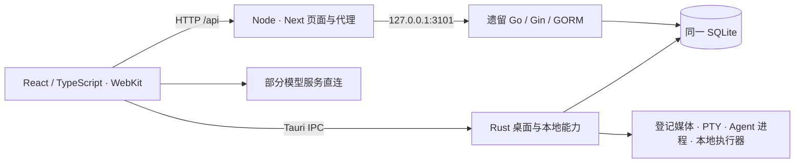

# 小陈的画布：完整运行检查与优化评估

## 结论

**当前版本的基础创作交互可以使用，但尚不能按“完整工作流全部通过”验收。** 本轮确认了本地原图导出、Codex 图片输入、保存失败处理三项优先修复问题；列表同步、界面状态保存、Kling 设置和历史连线数据也有明确缺口。

后端方向应继续收敛到 **Rust**。现在是 **React/TypeScript 前端 + Rust 桌面能力 + 遗留 Go API + Node 页面服务**，不能称为纯 Rust 后端，也不能直接移除 Go。迁移应保留前端并逐项替换实际依赖，详见后文。

本轮只审计，没有修改生产功能代码，没有重装或重启正式 App，没有发送模型对话或触发媒体生成。报告中的优先级是修复建议，不代表已经修复。

## 审计对象与证据边界

| 对象 | 本轮依据 |
|---|---|
| 正式 App | `/Users/chenhuajin/Applications/小陈的画布.app`，版本 1.0.0，identifier `com.chenyuxiaojin.infinitecanvas` |
| 源码 | 基于 HEAD `5d8eea13b415ff86062670a03cbffed4866162e0` **及审计开始时已有未提交改动**的 543 文件快照；不能只用 HEAD 重现 |
| 真实数据库 | 正式数据目录的 SQLite 在线只读备份；前后 `quick_check=ok`，实测 19 张表 |
| 当前案例 4 | 精确 ID `DUkqxVcwRh30uwMAskyxt`，48 节点、19 连线；另有同名旧项目 `case4-clench-murder`，39 节点、19 连线 |
| 原生检查 | 真实窗口导航、目录搜索、选中、设置、提示词、现有对话和项目终端 |
| 写入交互 | 本任务隔离 Chromium 浏览器，初始画布库为空；不具备 Tauri IPC，与正式 WebKit 的存储隔离 |
| 代码测试 | 独立源码快照、独立 Rust 构建目录；故障注入使用存储和协议替身，不调用模型 |
| 同期其他修改 | 另一任务进行了 Grok/Antigravity 源码接入；本报告不将未安装的新接入计作正式 App 已通过 |

证据包：[本轮证据说明](/Users/chenhuajin/项目/自己的应用/infinite-canvas-backups/audits/gpt6-20260905-01a06f3f/README.md)。其中数据库备份包含私有业务数据，仅本机留存。源码快照、日志和复现脚本均已独立保存。

以下严格区分：**实机观察**、**真实源码的隔离复现**和**尚待验证的推断**。已有单元测试通过不能覆盖未测的端到端路径。

源码分析及行号以审计快照为准；链接指向当前工作区，可能随后随并行开发移动。证据包内的源码归档与 543 文件哈希清单可用于准确复现。

## 优先修复项

### F1 · P1：本地登记原图可能被导出 ZIP 静默遗漏

**事实：隔离复现成立。** 给真实导出函数传入 `local-ref:asset-audit` 图片，并模拟其原图不在 IndexedDB `media_files` 中，函数成功生成 ZIP，但里面只有 `projects.json`，嵌入媒体数量为 0；节点仍指向原 `local-ref`。

代码根据 `image:` 前缀选择图片库，其他键一律交给 `getMediaBlob`；后者仅从媒体 IndexedDB 取 Blob，没有解析 Rust 登记目录。取不到时直接跳过，没有缺失清单或失败提示。

- 定位：[canvas-export.ts:16](/Users/chenhuajin/项目/自己的应用/infinite-canvas/web/src/app/(user)/canvas/utils/canvas-export.ts:16)、[file-storage.ts:142](/Users/chenhuajin/项目/自己的应用/infinite-canvas/web/src/services/file-storage.ts:142)。
- 证据：[additional-probes.json](/Users/chenhuajin/项目/自己的应用/infinite-canvas-backups/audits/gpt6-20260905-01a06f3f/evidence/additional-probes.json)、[实际复现 ZIP](/Users/chenhuajin/项目/自己的应用/infinite-canvas-backups/audits/gpt6-20260905-01a06f3f/evidence/local-ref-export-probe.zip)。
- 影响：用户可能把“导出成功”当成完整备份。换机器或导入新项目后，原登记引用未必可解析。当前案例 4 正在使用这种本地登记原图，因此有现实适用风险。
- 边界：未实际导出真实片子，没有证明其每一张原图都丢失；机制已由真实导出模块和真实 ZIP 产物复现。
- 建议：通过统一 Rust 受限媒体读取入口解析 `local-ref`，导出时记录完整媒体清单、大小和哈希；缺失媒体必须报告，不能默默生成“完整备份”。导入新 ID 后重新登记映射。
- 验收：混合 IndexedDB 图片、本地登记图片、历史版本、视频/音频的包，在全新隔离项目导入后逐项核对字节与引用；另测缺文件、取消保存、中文文件名。

### F2 · P1：选中的本地原图没有作为图片输入传给 Codex

**事实：原生引用标签存在，隔离协议复现只有文本输入。** 从真实节点引用构造函数开始，`local-ref` 保留为 `dataUrl`。Codex runtime 仅接收 `data:image/` 或 HTTP(S) 图像地址，过滤掉该引用，最终 `turn/start.input` 只有 `text`。

- 定位：[canvas-resource-references.ts:19](/Users/chenhuajin/项目/自己的应用/infinite-canvas/web/src/app/(user)/canvas/utils/canvas-resource-references.ts:19)、[canvas-codex-runtime.ts:144](/Users/chenhuajin/项目/自己的应用/infinite-canvas/web/src/app/(user)/canvas/agent/canvas-codex-runtime.ts:144)。
- 原生观察：选中杰克定妆照后，输入区显示同名图片引用；这只能证明 UI 引用了节点。
- 影响：用户要求“看这张原图”时，模型可能只收到节点标题和引用说明。`get_node` 返回元数据也不能等同于模型实际看到了图像。
- 边界：没有发起本轮付费/订阅模型请求；复现检查的是实际 runtime 构造的输入，不推断模型已经错误识图。
- 建议：发送前通过 Rust 解析受限本地媒体，转换成目标协议支持的图片输入；解析失败时在当前引用上明确提示。复用同一媒体解析能力覆盖 Codex 和新 Agent 接入。
- 验收：原图、历史图、普通 Blob 图及 HTTP 图分别验证协议中的图像数量、类型、实际字节来源；取消/失败时不能悄悄退化成仅文本。

### F3 · P1：保存错误被吞掉，随后刷新可覆盖未保存编辑

**事实：故障注入复现成立；未观察到真实用户正文丢失。** 在隔离存储中编辑节点后，让桌面保存返回错误；等待保存定时器执行，再刷新桌面数据，内存正文从 `unsaved edit` 回到旧值 `saved`，刷新仍成功返回。

- 定位：[use-canvas-store.ts:68](/Users/chenhuajin/项目/自己的应用/infinite-canvas/web/src/app/(user)/canvas/stores/use-canvas-store.ts:68)、[刷新与合并:462](/Users/chenhuajin/项目/自己的应用/infinite-canvas/web/src/app/(user)/canvas/stores/use-canvas-store.ts:462)。
- 原因：保存的 rejection 被 `.catch(() => undefined)` 忽略；随后桌面合并直接使用服务端业务字段，仅保留本地视口/面板字段，没有保护尚未成功落盘的编辑。
- 影响：磁盘错误、IPC 中断、版本冲突等情况下可能静默覆盖编辑；首页的同步状态不能证明最后一次编辑已保存。
- 建议：为每个项目记录待保存版本、保存中/已保存/失败状态及最后成功 revision；有未保存变更时不能以旧快照覆盖。失败时保留可恢复内容，允许明确重试。
- 验收：保存失败后导航/重载、快速连续编辑、延迟响应乱序、多 Agent 冲突、关闭前尚有待保存内容。通过标准是内容保留且错误可见，而不只是函数未抛错。

### F4 · P2：已删除项目仍留在列表，首页却显示已同步

**事实：正式首页和列表有 8 项；当前 SQLite 与 Rust CLI 只有 5 个有效项目。** 多出的弹药库及两个 P3 测试项目来自浏览器旧记录。

真实合并函数保留全部本地项目，并尝试把桌面列表没有的项目写回；Rust 对 tombstone 返回 `PROJECT_DELETED`，前端 `Promise.allSettled` 忽略失败后仍显示本地项目。隔离复现得到两个返回项目、一次被拒写入、加载未报错。

- 定位：[初始化合并:220](/Users/chenhuajin/项目/自己的应用/infinite-canvas/web/src/app/(user)/canvas/stores/use-canvas-store.ts:220)、[桌面刷新:462](/Users/chenhuajin/项目/自己的应用/infinite-canvas/web/src/app/(user)/canvas/stores/use-canvas-store.ts:462)、[首页同步提示:43](/Users/chenhuajin/项目/自己的应用/infinite-canvas/web/src/app/(user)/page.tsx:43)。Rust 的删除保护本身见 [canvas.rs:193](/Users/chenhuajin/项目/自己的应用/infinite-canvas/integrations/local-agent-adapter-rust/src/canvas.rs:193)。
- 影响：用户误以为项目已恢复或已同步；实际是在界面里显示旧缓存，**不是已证实数据库复活**。
- 建议：服务端明确返回删除状态/同步结果；只在有明确来源的新本地项目上执行导入。首页区分“服务已连接”与“全部保存已确认”。
- 验收：旧缓存、桌面删除、新离线项目、拒绝写入、重启后列表数量与有效 ID 一致；不能靠直接清空用户 IndexedDB 解决。

### F5 · P2：仅调整视口或面板时，重载后设置丢失

**事实：浏览器交互和源码探针均复现。** 隔离画布正文、拖动位置重载能保留；随后单独设置缩放 5%、收起左栏、打开 Agent，等待数秒再重载，恢复到 100%、左栏展开、Agent 关闭。

- 定位：[UI-only 字段及保存逻辑:58](/Users/chenhuajin/项目/自己的应用/infinite-canvas/web/src/app/(user)/canvas/stores/use-canvas-store.ts:58)、[updateProject:418](/Users/chenhuajin/项目/自己的应用/infinite-canvas/web/src/app/(user)/canvas/stores/use-canvas-store.ts:418)。
- 探针结果：三种 UI-only 更新分别都改变内存状态，但桌面保存 0 次、项目分片写入 0 次，只写索引 1 次。
- 影响：打开画布后反复重新找位置；内容编辑是否恰好发生会影响 UI 状态能否顺带落盘。
- 建议：把视口和面板作为每项目独立、低频持久化的 UI 状态，不增加业务内容 revision，也不依赖后续正文编辑。
- 验收：只有 UI 状态变化、无后续内容编辑的重载和原生重启；逐项目恢复且不能互相串用。

### F6 · P2：部分 Kling 视频设置分支会抛 ReferenceError

**事实：类型检查报错，真实辅助函数复现 `ReferenceError: channelIdForActiveModel is not defined`。** `isProviderKlingConfig` 使用了未定义的 `channelIdForActiveModel` 与 `localChannelForActiveModel`。

- 定位：[video-settings-panel.tsx:504](/Users/chenhuajin/项目/自己的应用/infinite-canvas/web/src/components/video-settings-panel.tsx:504)。
- 触发：匹配到对应 Kling 模型分支。当前默认 MiniMax-H3 设置页可打开，因此不能说默认视频面板已经崩溃。
- 建议：将实际渠道依赖显式传入/在函数内解析，避免引用组件作用域之外的变量；恢复类型检查作为必要检查。
- 验收：匹配和不匹配的模型、本地与服务端渠道、所有调用该函数的 Kling 变体，只打开配置不生成。

### F7 · P2：历史项目中存在指向已不存在节点的连线

**事实：直接对前后数据库图结构检查发现：** 案例 3 的 11 条连线两端节点均不在当前 5 节点列表中；旧案例 4 的 19 条连线中有 12 条至少缺一端。当前绑定案例 4 的 48/19、案例 2 的 17/10 没有此问题，所有有效项目均无重复节点 ID。

- 证据：[graph-integrity.json](/Users/chenhuajin/项目/自己的应用/infinite-canvas-backups/audits/gpt6-20260905-01a06f3f/evidence/graph-integrity.json)。
- 影响：连线数量不等于可见有效关系，Agent 可能得到不完整图关系，旧项目恢复和迁移会带着这些问题继续传播。
- 未知：没有追溯到产生这些历史记录的具体写入操作，不能归因于本轮 UI 删除或新 Agent 接入。
- 建议：增加只读图结构诊断；在导入、保存、Agent 变更时校验端点和 ID。历史修复须先列出缺失节点与可恢复来源，不自动删除悬空边或补造节点。

## 优化项与尚未证实的风险

### 持续平移时的可见节点更新

源码中画布变换立即写 DOM，但 React 视口更新依赖 80ms 空闲窗口，可见节点又依据 React 视口及 280px 余量剔除。隔离模拟 60 次、间隔 16ms 的持续输入：960ms 内视口状态提交 0 次，停下后才提交 1 次；可构造“节点已进入实时视口但仍未挂载”的情况。

定位：[视口更新:1416](/Users/chenhuajin/项目/自己的应用/infinite-canvas/web/src/app/(user)/canvas/[id]/canvas-client-page.tsx:1416)、[可见节点:877](/Users/chenhuajin/项目/自己的应用/infinite-canvas/web/src/app/(user)/canvas/[id]/canvas-client-page.tsx:877)。**这是代码层已证实的时序风险，未取得正式 WebKit 中逐帧缺图的视觉证据。** 建议将可见集合更新按帧/节流推进，持久化仍可延迟；先补长距离连续平移的原生录像和测量，再决定具体优化。

拖动一节点时，连接路径仍遍历全部显示连线。Node 假 DOM 测试的 p95：48 节点/47 边 0.078ms，500/499 为 2.429ms，2000/1999 为 33.521ms。这不包含 WebKit 绘制、布局和真实分组成本，不能当 App FPS。建议用节点索引和相邻连线集合减少重复工作，待真实大图复测后排序投入。

### SOP 来源和阶段判断需要可核验

正式 Codex 历史中已有 4 轮、8 条消息，阶段建议至少两次被用户纠正。当前内置工作流字符串已经包含资产/参考图阶段门槛，因此**不能断言整套 SOP 已过期**。

可证事实是：运行时使用内置 Skill 提示词，且当前 Codex 连接指令禁止读取项目文件；界面未展示本次采用的实际 SOP 路径、版本或资产门槛检查结果。定位：[提示词构造](/Users/chenhuajin/项目/自己的应用/infinite-canvas/web/src/app/(user)/canvas/agent/canvas-agent-skills.ts:1)、[Codex 指令:134](/Users/chenhuajin/项目/自己的应用/infinite-canvas/web/src/app/(user)/canvas/agent/canvas-codex-runtime.ts:134)。

建议从当前绑定片子明确提供已批准的 SOP 来源/内容，展示采用版本；阶段判断引用真实资产状态，把“必需参考图未完成”作为结构化检查结果。模型没有遵守现有提示词、真实 SOP 来源不一致、引用节点未读全是不同原因，本轮没有把它们混作同一已证实根因。

### 项目辨识与状态反馈

首页两个同名案例 4 只有节点数可辨，建议显示绑定目录及“当前绑定”标识。首页工具在线计数与设置探测的含义应一致或注明范围；本轮首页显示 0 个外部工具在线，设置中 Eagle 可用，可能是探测时机/统计口径不同，尚不单列功能缺陷。

对媒体也应区分：原图文件有效、当前页面已解码、Agent 已收到图片、导出已包含原文件。这四种成功不能共用一个笼统“已完成”推断。

## 实测覆盖与限制

| 模块 | 已执行与结果 | 尚未覆盖 |
|---|---|---|
| 正式 App / 服务 | 现有窗口可访问；签名严格检查通过；3100/3101/3102 均监听 loopback；首页、列表、案例页、API health 返回正常 | 本轮未冷启动、重启、升级安装或测试服务崩溃恢复 |
| 首页 / 全部画布 | 导航可用；核对 8 项界面与 5 项有效数据库记录，发现 F4 | 没有删除或清理真实卡片 |
| 真实案例 4 / 目录 | 48 节点；搜索定妆照得 3/48，杰克选中与引用标签出现 | 原生截图通道异常，未完成逐图视觉或同视口比较 |
| 原图文件 | 含历史记录共 32 份登记原图，427,634,172 字节；哈希/大小匹配，全部严格解码通过 | 文件有效不等于原生每张节点显示正确 |
| Rust 图片读取 | 当前顶层 20 个 local-ref 图片通过实际受限读取核心，合计 265,738,573 字节；单独用例通过 | 用数据库副本和只读媒体运行，不等同于 GUI IPC 逐图验收 |
| 文本 / 拖动 / 历史 | 隔离新建中文及 emoji、编辑、撤销、重做、拖动、重载后正文及位置通过 | 未写真实节点；未覆盖所有键盘快捷键、组合选择、分组缩放和连线创建/删除 |
| 视口 / 面板 | 隔离重载复现 F5；目录点击稳定后成功定位并恢复 100% 缩放 | 原生重启持久化未做 |
| 图片 / 素材库 | 隔离图片解码正常；存素材提示成功，回读可见，插入 60→61，撤销回 60 | 原图替换、裁剪、切图、下载、透明度、全景视觉均未完整验收 |
| 视频 | H.264 夹具解码、进度前进、单视频播放互斥通过 | 原生 WebKit、真实长视频、4K、多轨音频、声音听验未覆盖 |
| 老视频夹具 | MPEG-4 Part 2 出现进度推进但 videoWidth/Height=0 的黑画面，无 media error | 不能拿旧夹具作为视频播放通过证据；建议补“不支持视频轨”反馈 |
| Codex | 读取原对话、模型/上下文信息、选中引用；协议和生命周期由隔离测试覆盖；发现 F2 | 本轮未发新模型请求，没验收真实计费、生成、断网恢复和长轮次 |
| 项目终端 | 正式终端 pwd 回读准确片子目录；退出自身会话后 shell 回收，12 份绑定/配置哈希不变 | 仅运行只读 pwd；没有启动其他 Agent、长输出实机压力或更改项目配置 |
| 设置 / 工具 | 默认视频配置可打开；FFmpeg/Eagle 可用，Resolve 未运行，TTS 未就绪 | 没改凭据/模型配置，没实际调用外部工具任务 |
| 提示词 | 正式页面显示 1636，杰克搜索 2 条、详情全文正常 | 未执行收藏、目录编辑或同步；这些写入仍需隔离接口验收 |
| 导演台 / 音频 / 全景 | 已检查相关入口/源码；导演台工具点击记录不计编辑器验收通过 | 3D 编辑器内操作、全景互动、音频播放/录制/合成均待测 |
| 导出 / 导入 | 多媒体 fixture 导入成功；真实导出模块生成 local-ref 缺媒体复现包 | 未导出真实片子，未完成新机器全格式往返；F1 修复后必须补 |
| 错误 / 性能 | 有限 Chromium 平移测量、源码故障注入；末段浏览器 error/warn 为空 | 不代表整个会话、所有网络或原生进程没有错误；内存泄漏/持续数小时压力未测 |

Rust 原图 opt-in 测试原先写死“32 张顶层图”，与现在 20 张顶层有效原图加历史记录不符。本轮只在独立测试副本调整过滤条件/期望数，生产读取函数未改；测试差异随证据保存，源码归档已恢复原始快照。

原生截图曾返回白色小图或裁切图，自动化连接也发生过短暂失活；重新获取 App 文字结构后能继续。**这是验收能力的限制，不能把截图工具异常写成正式 App 白屏。** 图像放大预览的视觉验收也保留为未完成。

### 自动测试结果

| 检查 | 结果 |
|---|---|
| 前端/桌面脚本六组 Node 测试 | 87/87 通过：Codex、本地工作流、本地图像、终端背压、后台 Node、安装脚本 |
| Go `go test ./...` | 通过；config/handler/service 有测试，部分包无测试 |
| Rust 桌面 `cargo test --offline --locked` | 43 通过、1 opt-in 忽略；随后单独适配并执行真实原图只读用例通过 |
| TypeScript 全量检查 | **失败，4 文件共 8 条诊断**，不是“构建全部正常” |
| 额外源码探针 | 复现 F1–F4、F6；UI-only 探针与浏览器共同支撑 F5 |

类型错误分布：`canvas-resource-references.ts` 26/27 行的 metadata 可空共 4 条；`video-settings-panel.tsx` 508/509 行未定义变量 2 条；`gemini.ts` 44 行正则目标版本 1 条；`services/api/canvas-agent.ts` 164 行 content 可空 1 条。当前 Next 配置跳过类型错误，生产构建成功不能替代此检查。

日志：[前端测试](/Users/chenhuajin/项目/自己的应用/infinite-canvas-backups/audits/gpt6-20260905-01a06f3f/evidence/frontend-tests.log)、[Go 测试](/Users/chenhuajin/项目/自己的应用/infinite-canvas-backups/audits/gpt6-20260905-01a06f3f/evidence/go-tests.log)、[Rust 测试](/Users/chenhuajin/项目/自己的应用/infinite-canvas-backups/audits/gpt6-20260905-01a06f3f/evidence/rust-tests.log)、[类型检查](/Users/chenhuajin/项目/自己的应用/infinite-canvas-backups/audits/gpt6-20260905-01a06f3f/evidence/typecheck.log)。

既有 `source-diagnostics.json` 最后一条“local-ref media restoration FAIL”依赖旧实现假设，未考虑新的 display lease，**本报告不采纳该条为当前显示缺陷**。它与本轮独立复现的导出/模型输入缺陷不是同一个测试。

### 性能结论应如何使用

单次 HTTP：首页约 82.1ms、列表约 6.8ms、案例页约 32.3ms、API health 约 13.8ms。它们是本机已有服务的请求时间，不是冷启动或可交互时间。3102 无凭据健康请求返回 401 属于预期鉴权。

隔离 H.264 画布含 60 节点/59 边；约 1.96 秒的三次往返平移，采样 234 个 rAF 间隔，p50=8.3ms、p95=9.2ms、最大 9.4ms，无 >50ms 间隔和 long task。当时 CSS 视口 1580×889、缩放 251%，使用重复的 320×180 小素材，只有部分节点可见。

这些数据只说明该有限 Chromium 场景没有记录到明显长帧，**不证明正式 WebKit 能流畅处理全部 4K 原图，也不等于端到端输入延迟或原生 FPS**。修复正确性后，建议用真实高分辨率素材的隔离副本记录平移、连续缩放、节点拖动、视频播放期间的长帧、内存峰值和恢复情况。

## Go 到 Rust：当前职责、迁移顺序与验证点

### 运行结构

桌面启动顺序是先启动 Go 并等待 API 端口，再启动 Rust Bridge、Node/Next，最后创建 WebKit 窗口。见 [desktop lib.rs:225](/Users/chenhuajin/项目/自己的应用/infinite-canvas/desktop/src-tauri/src/lib.rs:225)。Next catch-all 代理仍将请求交给 Go，见 [route.ts:30](/Users/chenhuajin/项目/自己的应用/infinite-canvas/web/src/app/api/[...path]/route.ts:30)。因此移除 Go 会同时影响启动条件及仍在使用的功能。

Rust 已承担桌面壳、PTY、项目目录绑定、Bridge/画布操作、本地图像受限读取、Codex 进程与协议、本地执行器、外部工具探测和本地音频等。新增 Agent 接入沿用 Rust 是正确方向。React/TypeScript 继续负责界面、画布渲染、节点交互与前端模型请求；这次迁移没有理由重写前端。

### 仍依赖 Go 的清单

| 功能/接口族 | 当前调用方与职责 | 数据/副作用 | 迁移边界与关键验证 |
|---|---|---|---|
| `/api/health`、桌面启动等待 | Rust 启动器，Next 代理 | 服务就绪判定 | Rust 接管后保持状态码及就绪含义；API 未就绪时窗口错误应可解释 |
| `/api/settings` | `client-root-init`、`use-config-store.loadPublicSettings` | `settings` 2 行 | 保持配置响应默认值、兼容旧字段；不覆盖前端自配渠道和密钥 |
| 提示词列表/详情/分类/收藏/同步 | `services/api/prompts.ts`，正式提示词 UI | `prompts` 1645、`prompt_catalogs` 1584、`prompt_categories` 12、`prompt_favorites` 0；同步会访问本地/远端来源 | 保持筛选、分页、总数、全文、收藏幂等、按来源失败反馈；表计数不能直接与 UI 可见条数等同 |
| `/api/ai/direct-request` | `services/api/direct-ai.ts`，部分 KIE/APIMart 适配 | Go 将协议/模型/参数/上传标记转换成请求计划；实际请求随后由前端发送 | 迁移请求计划契约、媒体标记、URL/大小限制；用无网络契约测试比对，不触发真实生成 |
| `/api/proxy-image`、`/api/files/:id/content`、媒体引用读取 | `image-storage`、`file-storage`、全景/图片数据读取 | 远端代理、旧文件/引用解析；`storage_objects` 当前 0 行 | 保持 MIME、字节、流/Range、取消及错误语义；确认历史引用仍能加载，不能仅因表为空就删路径 |
| `/api/storage/config`、上传/登记/存储测量接口 | 前端存储服务及旧服务端存储分支 | 存储配置、WebDAV/远端服务、文件记录 | 区分目前本地默认模式与旧数据兼容；迁移不得改变外部凭据或自动执行上传/删除 |
| 旧账号画布同步与用户配置 | `user-config` 等保留服务，Go `/api/v1/canvas/projects*` | 与 Rust 共用 `canvas_projects`；`user_configs` 当前 0 | 桌面主路径已经走 Rust；旧 API 是否退役需根据实际保留用途决定，不能形成第二个无冲突控制的写入者 |
| 旧素材、工作流、历史与生成任务 | Go router 保留 assets/workflows/tasks/logs | `assets` 38、`creative_workflows` 1；本机列出的任务/生成日志目前为空 | 先决定读取兼容或退役，保留现有数据；正式“我的素材”是另一套本地存储，不应直接覆盖或合并 |
| 旧账户/后台/代理模型 API | auth/admin/credits 及 `/api/v1` 生成路由仍注册 | `users` 1，其余相关日志多为空 | 本地产品 UI 已收敛，不应为“纯 Rust”把全部旧云功能重新做一遍；按保留调用方列白名单，未迁移路径明确退役而非意外 404 |
| 启动初始化及后台任务 | Go `main.go` | 默认管理员初始化、提示词目录初始化/定时同步、画布删除清理、视频任务轮询 | 不遗漏行为，也不在迁移后重复初始化、双跑清理或恢复旧付费任务 |

接口来源：[Go router](/Users/chenhuajin/项目/自己的应用/infinite-canvas/router/router.go:11)、[提示词调用方](/Users/chenhuajin/项目/自己的应用/infinite-canvas/web/src/services/api/prompts.ts:40)、[请求计划调用方](/Users/chenhuajin/项目/自己的应用/infinite-canvas/web/src/services/api/direct-ai.ts:85)、[Go 启动逻辑](/Users/chenhuajin/项目/自己的应用/infinite-canvas/main.go:16)。路由存在不代表本轮实际点击了全部路径；上表对活跃功能与遗留接口作了区分。

普通 OpenAI 兼容图片/文本/音频等部分请求由前端直连服务，不应描述为“所有 AI 请求都经过 Go”。模型协议适配若仍保留在 TS，也不妨碍本地后端收敛为 Rust。

### 数据库责任不能只按语言搬文件

Go 的 [repository/db.go:73](/Users/chenhuajin/项目/自己的应用/infinite-canvas/repository/db.go:73) 当前负责主要模型 AutoMigrate；Rust 使用同一数据库并维护 `agent_operation_requests` 等操作记录，也读写 `canvas_projects`。迁移需要明确 schema owner、版本和兼容窗口，不能仅把一个 HTTP handler 翻译成 Rust 就移除 Go 的建表职责。

必须保留：项目 ID、完整 JSON 未知字段、时间戳格式、用户/项目作用域、删除 tombstone、Agent revision/CAS、幂等请求记录、媒体 rootId/assetId/relativePath/hash 以及片子目录绑定。当前 `.infinite-canvas/project.json` 使用 `project_id`，应以实际文件为准。

浏览器仍有业务存储与项目分片；正式与隔离浏览器并不共享。迁移数据库不会自动解决 F4/F5，也不能把现有 IndexedDB 库当可清空缓存。当前原图在登记媒体目录，数据库仅保存引用，必须把文件和注册映射一起纳入升级验收。

### 建议顺序

1. **先建立可回滚基线与契约。** 在线备份 SQLite、媒体注册、绑定配置及前端本地数据；记录 schema、每表计数、有效项目/删除项目及原图哈希。确定唯一写入责任和 Rust schema 版本；将 F1–F4 的失败场景加入迁移验收。
2. **替换健康检查、公开设置和提示词。** 它们在正式 UI 中确实活跃，适合先以兼容响应接管。先做只读双实现结果比较，再切换单一写入者；收藏、分类及同步分别做隔离写入回读。
3. **替换媒体/存储读取和请求计划接口。** 优先复用现有 Rust 本地媒体边界，统一显示、模型引用、导出所需读取。逐个覆盖 MIME、流、Range、失效引用和请求计划字段。真实生成不作为契约测试。
4. **处理后台任务与遗留接口。** 明确哪些功能保留、哪些只读兼容、哪些正式退役；迁移定时任务时避免双跑，保留旧记录，不顺手重启旧生成任务或清理历史项目。
5. **最后切换启动与打包。** 选择由 Rust 保持本机 HTTP 契约，或逐个替换为 Tauri IPC；若用 HTTP，应延续 loopback 与必要鉴权。Node/Next 代理保持可用；替代完成后才去除 Go sidecar、构建步骤、等待端口和资源声明。
6. **用正式升级流程验收和回滚演练。** 独立包验证后，再按用户授权安装；核对唯一 App、签名、子进程无额外 Dock 入口、健康状态、真实项目内容与媒体、绑定和旧 ZIP 导入。新版本失败时，旧程序能在对应备份上恢复，不能仅依靠“新 schema 向后兼容”的假设。

目前 [prepare-desktop.mjs](/Users/chenhuajin/项目/自己的应用/infinite-canvas/desktop/scripts/prepare-desktop.mjs) 和桌面启动仍依赖 Go。**以上是迁移清单和验证方案，本轮没有执行迁移。**

## 数据保留与交付状态

最终只读回读结果：

- 19 张表行数全部保持；其中 18 张表全部字段与基线一致。
- `canvas_projects` 仅当前案例 4 的 `viewport`、`updatedAt` 及行 `updated_at` 改变，符合本轮原生浏览操作；所有项目节点、连线及对话内容未变。没有为“恢复原样”强行覆盖真实库。
- 当前案例 4 的 32 份登记原图大小和哈希全部一致，合计 427,634,172 字节。
- 四个片子/验收目录的 12 份绑定与 Claude/Codex 配置哈希一致；正式 App 的桌面程序、CLI、Go sidecar 和 Node 四个二进制哈希一致。
- 浏览器测试只产生在隔离存储；性能观察器已关闭，临时标签页已关闭，尺寸覆盖已恢复。没有清理用户库、删除真实节点或终止用户原进程。
- 生产仓库本轮仅新增这份报告；同期其他任务的源码/文档改动保留，并记录在最终源码状态证据中。本轮未更新 todo/pending-test，因为任务明确只交付独立审计报告，没有实施功能修复。

证据：[最终读回](/Users/chenhuajin/项目/自己的应用/infinite-canvas-backups/audits/gpt6-20260905-01a06f3f/evidence/final-readback.json)、[界面观察记录](/Users/chenhuajin/项目/自己的应用/infinite-canvas-backups/audits/gpt6-20260905-01a06f3f/evidence/ui-observations.md)、[原图解码](/Users/chenhuajin/项目/自己的应用/infinite-canvas-backups/audits/gpt6-20260905-01a06f3f/evidence/image-decode.json)。

建议先修 F1–F3，再处理 F4–F7；性能优化随后用正式 WebKit 实测排序。付费模型调用、真实生成、安装升级、3D/全景完整视觉、音频和长时间压力仍未完成，不能在后续交付中省略这些边界。
